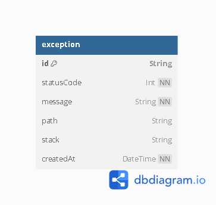

# NestJS REST API boilerplate CIREBOX

[](https://github.com/new?template_name=boilerplate-nestjs&template_owner=cirebox)

## Description
NestJS REST API boilerplate for a typical project

## Table of Contents <!-- omit in toc -->

- [Features](#features)
- [Contributors](#contributors)
- [Support](#support)
- [DB Diagram](#dbdiagram)
- [Installation](#installation)

## Features

- [x] Prisma Database ORM.
- [x] Seeding

- [x] GRPC.
- [x] RabbitMQ.

- [x] Swagger

- [ ] Mailing ([nodemailer](https://www.npmjs.com/package/nodemailer)).
- [ ] File uploads. Support local and Amazon S3 drivers.

- [x] Units tests.
- [ ] E2E tests 

- [ ] Docker.
- [ ] CI (Github Actions).

## Contributors

<!-- ALL-CONTRIBUTORS-LIST:START - Do not remove or modify this section -->
<!-- prettier-ignore-start -->
<!-- markdownlint-disable -->
<table>
  <tbody>
    <tr>
      <td align="center" valign="top" width="14.28%">
        <a href="https://github.com/Shchepotin">
            
            <br />
            <sub>
                <b>Eric Pereira</b>
            </sub>
        </a><br />
        <a href="#maintenance-Shchepotin" title="Maintenance">🚧</a> 
        <a href="#doc-Shchepotin" title="Documentation">📖</a> 
        <a href="#code-Shchepotin" title="Code">💻</a>
        <a href="#business-sars" title="Business development">💼</a>
      </td>      
    </tr>
  </tbody>
</table>
<!-- markdownlint-restore -->
<!-- prettier-ignore-end -->
<!-- ALL-CONTRIBUTORS-LIST:END -->

## Support
If you seek consulting, support, or wish to collaborate, please contact us via [suportecire@gmail.com](mailto:suportecire@gmail.com). For any inquiries regarding boilerplates, feel free to ask on [GitHub Discussions](https://github.com/cirebox/boilerplate-nestjs/discussions).

## DBDiagram



Generate diagram using [dbdiagram](https://dbdiagram.io/d) copying the contents of the dbml file

## Installation
```bash
$ pnpm install
```

## DB Generate
```bash
$ npx prisma generate
```

## Seed
```bash
$ npx prisma db seed
```

## Running

```bash
# development
$ pnpm run start

# watch mode
$ pnpm run start:dev

# production mode
$ pnpm run start:prod
```

## Test

```bash
# unit tests
$ pnpm run test

# unit watch
$ pnpm run test:watch

# e2e tests
$ pnpm run test:e2e

# test coverage
$ pnpm run test:cov
```

Author - [Eric Pereira](https://portfolio-eric-pereira.vercel.app/)