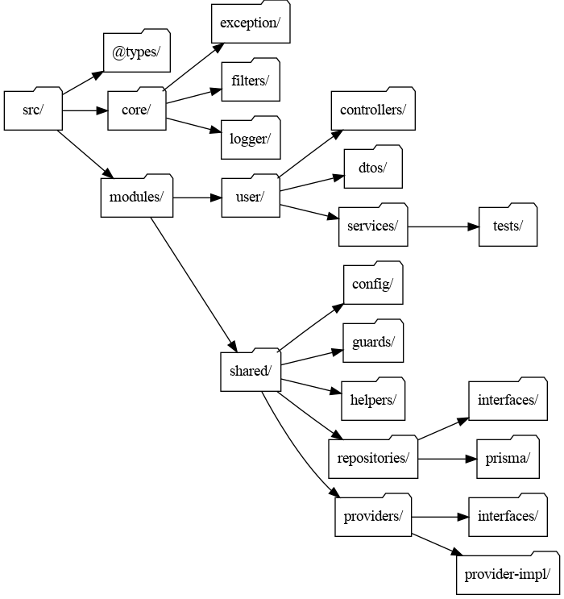

[**Arquitetura Modular**](https://docs.nestjs.com/modules "https://docs.nestjs.com/modules")
    

A arquitetura modular permite dividir a aplicação em partes menores e independentes, que encapsulam funcionalidades específicas. No NestJS, módulos são organizados usando a anotação `@Module`.

 **Estrutura de Pastas**
   
Sugestão de estrutura de pastas para um projeto modular.

### **1. Raiz do Projeto**

-   `src/`  
    Contém o código-fonte principal da aplicação, organizado em módulos e camadas de funcionalidades.
    

----------

### **2.** `@types/`

-   Diretório reservado para definições de tipos TypeScript globais, como padrão de retorno em requisições http, estrutura base para entidades e depois tipos utilizados na aplicação.
    
-   Exemplos na estrutura:
    
    -   `Core.d.ts`: Definições principais relacionadas ao núcleo da aplicação.
        
    -   `User.d.ts`: Tipos específicos para manipulação de usuários.
        

----------

### **3.** `core/`

-   Contém a lógica central e genérica da aplicação que pode ser reutilizada por diferentes módulos da aplicação, como decorators, filters e manipuladores de log.
    

----------

### **4.** `modules/`

-   Contém os módulos principais da aplicação, cada um encapsulando uma funcionalidade específica.
    
    -   `controllers/`
        
        -   `http.controller.ts`: Controlador para gerenciar requisições http em endpoints relacionados ao modulo.
            
        -   `mq.controller.ts`: Controlador para gerenciar comunicação por meio de filas relacionadas ao modulo.
            
    -   `dtos/`
        
        -   Data Transfer Object estrutura que define exatamente quais dados serão enviados ou recebidos pela aplicação, garantindo maior clareza, segurança e consistência nas interações entre as camadas de controllers e services.
            
    -   `services/`
        
        -   `create.service.ts`: Camada que concentra todos os casos de uso do modulo, cada service com sua respectiva responsabilidade.
            
            -   `update.service.ts`
                
    -   `tests/units/`
        
        -   Testes unitários para os serviços acima, com arquivos como `create.service.spec.ts` e `find-by-id.service.spec.ts`.
            
-   `user.module.ts`: Configuração do módulo de usuário com todos os provedores, controles e importes.

----------

### **5.** `shared/`

-   Módulo para componentes reutilizáveis em toda a aplicação, como integração com banco de dados e provedores externos. O modulo shared tem por padrão a função de exportar os seus provedores de forma nomeada e com isso podemos importar nos demais módulos de forma nomeada.
   

#### **5.1.** `config/`

-   Configurações globais do sistema.
    

#### **5.2.** `guards/`

-   Guardas de rota para validação de autenticação e permissões.
    

#### **5.3.** `helprs/`

-   Funções utilitárias para suporte a funcionalidades comuns, como uso de bibliotecas para requisição http e mensageiria.
    
    -   `interfaces/`
        
        -   `ihttp.helper.ts` Definições personalizadas para http como por exemplo método de autenticação.
            
        -   `iqueue.helper.ts` Definições personalizadas que um mq precisa possuir como por exemplo método para criação de filas seguindo um padrão.
            
        -   `iorm.helper.ts` Definições personalizadas que o orm precisa seguir como por exemplo forma de se fazer o soft delete.
            
    -   `mq.helper.ts` toda a implementações personalizadas dos helper de mq.
        

#### **5.4.** `repositories/`

-   Implementação dos repositórios para acesso a dados, com definições pré estabelecidas para o funcionamento da aplicação por meio de interfaces e implementação utilizando orms.
    
    -   `interfaces/`: Interfaces para padronizar repositórios.
        
        -   `iuser.repository.ts`: Métodos base e necessários para comunicação com entidade de usuário.
            
    -   `prisma-orm/`: Implementação de repositórios utilizando Prisma como ORM.
        
        -   `user.repository.ts`: Implementação dos métodos utilizando o prisma
            

**5.5.** `providers/`

-   Implementação dos provedores para acesso a serviços externos, com definições pré estabelecidas para o funcionamento da aplicação por meio de interfaces e implementação utilizando bibliotecas de comunicação com serviços externos como axios.
    
    -   `interfaces/`: Interfaces (contratos) para padronizar integração com provedores.
        
        -   `imeteorologia-provider.ts`: Definições base para implementação de integração com api de meteorologia.
            
    -   `providers/`
        
        -   `imeteorologia-provider.ts`: Implementação da integração com api de meteorologia seguindo os requisitos definidos na interface.
            

----------

## **Conclusão**

Essa estrutura de pastas e arquitetura modular proporciona:

1.  **Clareza:** Cada funcionalidade possui seu próprio módulo.
    
    -   Desacoplamento, deixando cada modulo com suas respectivas responsabilidades.
        
    -   Facilidade na escalabilidade.
        
    -   Código mais legível facilitando a compreensão e manutenção.
        
    -   Diminuindo curva de aprendizagem.
        
    -   Ganho de performance do time ao desenvolver novas features.
        
2.  **Reutilização:** Componentes reutilizáveis ficam no diretório `shared`.
    
    -   Diminuição de códigos repetidos.
        
    -   Diminuição de inconsistências.
        
    -   Facilitando manutenção.
        
3.  **Escalabilidade:** Novas funcionalidades podem ser adicionadas facilmente sem impactar outros módulos.
    
    -   Facilitando rotinas de tests
        
    -   Implementação de novas funcionalidades
        
    -   Documentação de features
        

----------
