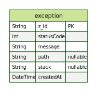

# Data Base
This document describes part of the database used in the [Prisma](https://www.prisma.io/docs/getting-started) project.
## Database Structure


Generate the diagram using [dbdiagram](https://dbdiagram.io/d) by copying the contents of the dbml file in the /prisma folder.

## DB Generate
```bash
$ npx prisma generate
```

## Seed
```bash
$ npx prisma db seed
```