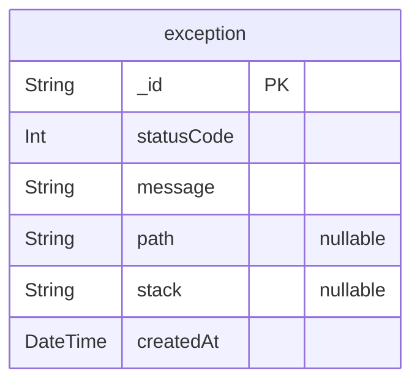

# erd
> Generated by [`prisma-markdown`](https://github.com/samchon/prisma-markdown)

- [exception](#exception)

## exception

### `exception`
Tabela de exceções e erros, onde são registradas informações de erros ocorridos na aplicação.
Cada registro representa uma exceção com detalhes do erro para fácil rastreamento e análise.

**Properties**
  - `_id`: ID único da exceção, gerado automaticamente em formato UUID.
  - `statusCode`
    > Representa o código de status HTTP da exceção.
    > Exemplo: 404 para "Não Encontrado", 500 para "Erro Interno do Servidor".
  - `message`
    > Mensagem descritiva do erro ou exceção.
    > Indica a natureza do problema encontrado.
  - `path`
    > Caminho ou rota onde o erro ocorreu, se aplicável.
    > Este campo é opcional e pode ajudar a identificar o local exato no código que causou o erro.
  - `stack`
    > Stack trace do erro, útil para depuração.
    > Este campo é opcional e pode fornecer informações detalhadas sobre o fluxo de execução.
  - `createdAt`
    > Data e hora em que o erro foi registrado.
    > Valor padrão é a data e hora atual.